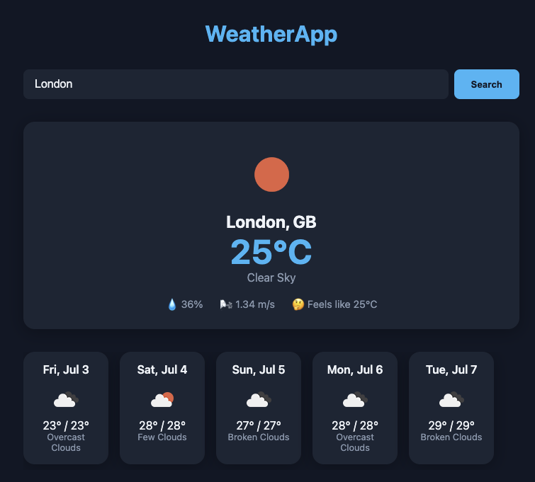

# Responsive Weather Application

A modern, full-stack weather application that provides real-time weather information and a 5-day weather forecast for any city around the globe. The project features a robust Python backend built with FastAPI and a clean, responsive, glassmorphic user interface built with vanilla HTML, CSS, and JavaScript.


---

## 📁 Project Structure

```text
weather-app/
│
├── backend/
│   ├── main.py
│   ├── services/
│   │   └── weather.py
│   ├── models/
│   │   └── schemas.py
│   └── .env
│
├── frontend/
│   ├── index.html
│   ├── style.css
│   └── app.js
│
├── requirements.txt
└── README.md
```

---

## Key Features

* **Live Weather Data:** Instantly retrieves real-time weather conditions, humidity, wind speeds, and precise "feels like" metrics for any global city.
* **5-Day Weather Forecast:** Seamlessly tracks upcoming shifts with high/low temperature ranges and contextual weather status.
* **Automated Data Validation:** Backed by robust Pydantic schemas in Python to ensure dependable, crash-proof API integrations.
* **Async Backend Performance:** Driven by FastAPI for lightweight async execution and automatic, interactive OpenAPI documentation (`/docs`).
* **Sleek Glassmorphic Design:** Built with a beautiful, fully responsive dark-theme glassmorphism layout tailored for both desktop and mobile views.

---

## Tech Stack

### Backend
* **Python 3.11+**
* **FastAPI** — Modern web framework for high-performance API endpoints.
* **Uvicorn** — Lightning-fast ASGI server implementation.
* **Pydantic** — Strict data parsing and validation models.
* **HTTPX / Requests** — Asynchronous web requests to third-party endpoints.

### Frontend
* **HTML5 & CSS3** — Structured layouts utilizing custom variables, CSS Grid, and Flexbox.
* **Vanilla JavaScript** — Modern asynchronous `fetch()` API calls and dynamic DOM rendering.

---

## Setup & Installation

### Prerequisites
* Python 3.11 or higher installed.
* A free API key obtained from [OpenWeatherMap](https://openweathermap.org/api).

### 1. Backend Setup

1. Open your terminal and navigate to your project root folder.
2. Initialize and activate a localized Python virtual environment:
   ```bash
   python -m venv venv
   source venv/bin/activate  # On Windows use: venv\Scripts\activate
   ```

3. Install the required Python dependencies:
   ```bash
   pip install -r requirements.txt

4. Create a `.env` file inside the `backend/` directory:

   ```env
   OPENWEATHER_API_KEY=your_api_key_here
   ```

5. Start the FastAPI development server:

   ```bash
   cd backend
   uvicorn main:app --reload
   ```

6. Verify the backend is running by opening:

   ```
   http://127.0.0.1:8000/docs
   ```

   FastAPI automatically generates interactive API documentation where you can test all available endpoints.

---

## 2. Frontend Setup

The frontend is built using plain HTML, CSS, and JavaScript, so no additional dependencies are required.

Navigate to the frontend directory:

```bash
cd frontend
```

You can either:

* Open `index.html` directly in your browser, or
* Serve the folder with a lightweight development server.

Example using Python:

```bash
python -m http.server 5500
```

Then open:

```
http://localhost:5500
```

---

# API Endpoints

## Get Weather by City

Returns the current weather conditions together with a 5-day weather forecast.

**Endpoint**

```
GET /weather/{city}
```

### Example Request

```
GET /weather/London
```

### Successful Response

```json
[
  {
    "city": "London",
    "temperature": 22.4,
    "feels_like": 21.9,
    "humidity": 68,
    "wind_speed": 4.2,
    "description": "broken clouds",
    "icon": "04d"
  },
  [
    {
      "date": "2026-07-03",
      "temp_min": 18.5,
      "temp_max": 24.1,
      "description": "light rain",
      "icon": "10d"
    }
  ]
]
```

---

# Future Improvements

Possible enhancements include:

* Current location weather using Geolocation API
* Search history
* Favorite cities
* Hourly weather forecast
* Air Quality Index (AQI)
* Sunrise and sunset times
* Weather maps
* Dark/Light mode toggle
* Unit switching (°C / °F)

---

# Requirements

Example `requirements.txt`

```text
fastapi
uvicorn
httpx
python-dotenv
pydantic
```

Install all dependencies with:

```bash
pip install -r requirements.txt
```

---
# Author

Developed as a full-stack weather application using FastAPI and Vanilla JavaScript to demonstrate modern backend API development, asynchronous programming, RESTful communication, and responsive frontend design.

```
GitHub: yerzakovakmal
```
